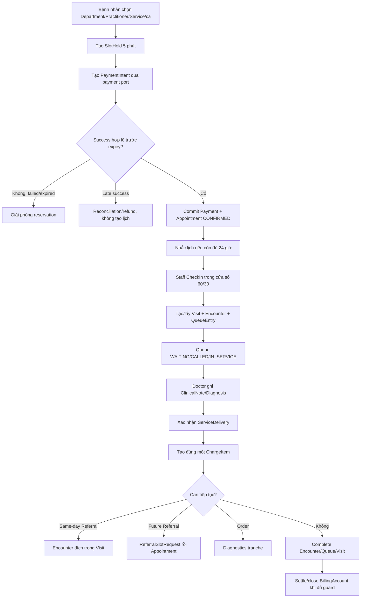
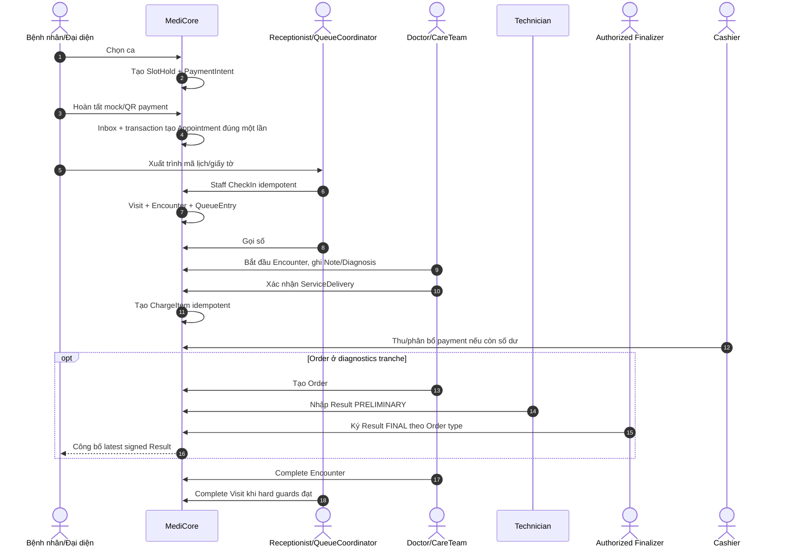
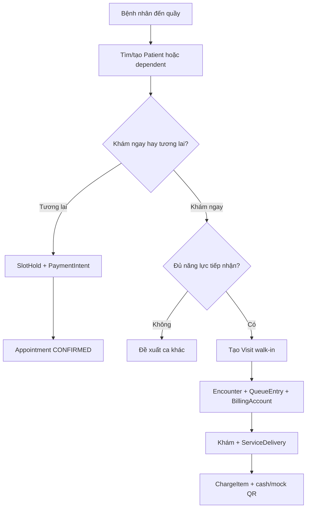

---
aliases:
  - Sơ đồ luồng nghiệp vụ
tags:
  - do-an/so-do
source_sections:
  - 4
  - 5
  - 6
---
# Sơ đồ luồng nghiệp vụ

<!-- obsidian-nav:start -->
[[02-tac-nhan-va-chuc-nang|Phần trước]] · [[docs|Mục lục]] · [[04-vong-doi-va-nghiep-vu-lich-kham|Phần tiếp theo]]
<!-- obsidian-nav:end -->

## 4. Sơ đồ luồng tổng thể

## 5. Sơ đồ phối hợp giữa các tác nhân

`Authorized Finalizer` là PractitionerRole có permission chuyên môn; Admin không mặc định ký Result.

## 6. Luồng đăng ký trực tiếp tại quầy

Walk-in không cần Appointment giả. CheckIn ngoại lệ ngoài cửa sổ cần staff permission và reason.

---

<!-- related-links:start -->
## Liên kết liên quan

- [[04-vong-doi-va-nghiep-vu-lich-kham|Vòng đời và ca khám]]
- [[05-thanh-toan-va-doanh-thu|Payment]]
- [[11-mo-hinh-du-lieu|Mô hình dữ liệu]]
- [[20-so-quyet-dinh-kien-truc|Kiến trúc]]
<!-- related-links:end -->
