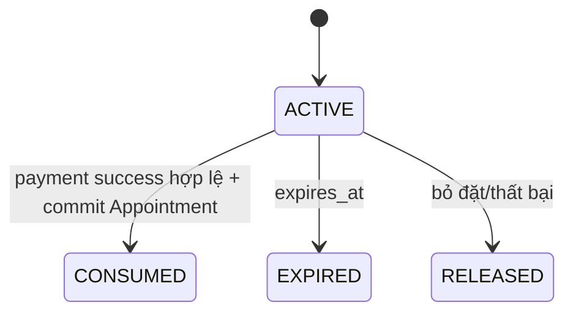
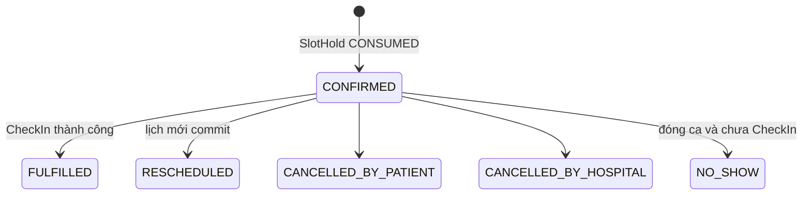
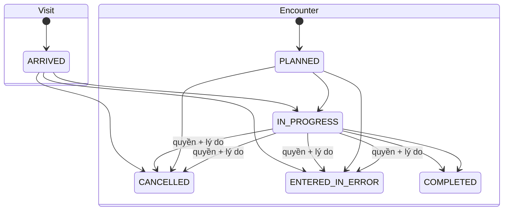
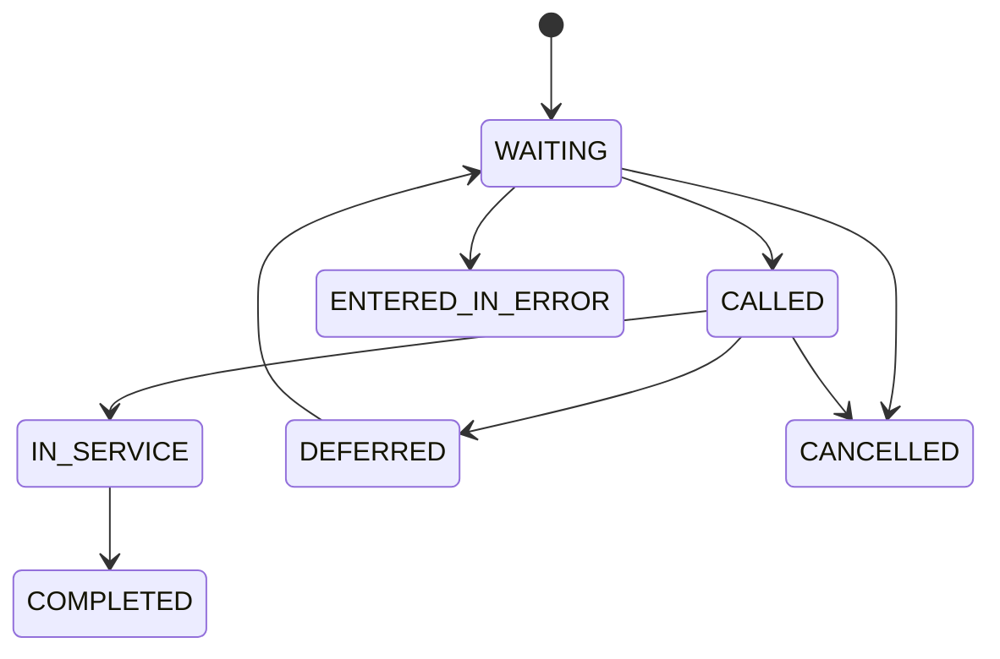

---
aliases:
  - Vòng đời Appointment, Visit và Encounter
tags:
  - do-an/nghiep-vu
tags_extra:
  - scheduling
source_sections:
  - 7
  - 8
---
# Vòng đời Appointment, Visit và Encounter

<!-- obsidian-nav:start -->
[[03-so-do-luong-nghiep-vu|Phần trước]] · [[docs|Mục lục]] · [[05-thanh-toan-va-doanh-thu|Phần tiếp theo]]
<!-- obsidian-nav:end -->

## 7. Vòng đời SlotHold, Appointment, Visit và Encounter

Mỗi resource có vòng đời độc lập. PaymentIntent tồn tại trong SlotHold; Appointment chỉ xuất hiện sau payment outcome hợp lệ.

### 7.1. Trạng thái SlotHold

| Trạng thái | Ý nghĩa |
|---|---|
| `ACTIVE` | Giữ reservation trong 5 phút |
| `CONSUMED` | Payment hợp lệ và đã tạo Appointment |
| `EXPIRED` | Hết hạn chưa có success hợp lệ |
| `RELEASED` | Người dùng bỏ hoặc giao dịch kết thúc thất bại |



SlotHold lưu Patient, AppointmentSlot, `expires_at`, deposit snapshot, currency và idempotency key. Payment success sau khi hold không còn sử dụng được không hồi sinh hold hoặc tạo Appointment; chuyển reconciliation/refund.

### 7.2. Trạng thái Appointment

| Trạng thái | Ý nghĩa |
|---|---|
| `CONFIRMED` | Lịch được xác nhận và giữ capacity |
| `FULFILLED` | CheckIn hợp lệ tạo/lấy Visit |
| `RESCHEDULED` | Được thay bằng Appointment mới có lineage |
| `CANCELLED_BY_PATIENT` | Bệnh nhân hủy |
| `CANCELLED_BY_HOSPITAL` | Bệnh viện hủy |
| `NO_SHOW` | Hết ca vẫn CONFIRMED và chưa có CheckIn/Visit hợp lệ |



Appointment `CONFIRMED` và `FULFILLED` đều đã tiêu thụ reservation; check-in không mở lại capacity. Appointment không mang trạng thái payment, queue hoặc đang khám.

### 7.3. Trạng thái Visit và Encounter



Visit hoàn tất khi mọi Encounter terminal và mọi QueueEntry ở `COMPLETED`, `CANCELLED` hoặc `ENTERED_IN_ERROR`, không còn same-day Referral pending. Order, Result, Episode hoặc billing còn mở tạo warning/follow-up; không chặn clinical completion. Cancel/error sau khi bắt đầu bắt buộc role, reason, version và audit; không xóa dữ liệu đã sinh.

### 7.4. Ca khám và sức chứa

- Tối đa 4 ca/bác sĩ/ngày, 2 ca sáng và 2 ca chiều.
- Admin cấu hình `start_at`, `end_at`, capacity theo PractitionerRole, Department và Service.
- Bệnh nhân chọn ca, không chọn phút Encounter.
- Capacity reservation = SlotHold ACTIVE + Appointment CONFIRMED/FULFILLED/RESCHEDULE pending commit phù hợp; trạng thái terminal hủy/no-show/rescheduled cũ không chiếm chỗ.
- Tạo/chốt hold khóa AppointmentSlot và kiểm tra invariant trong transaction.
- Ca đã có reservation không sửa giờ/capacity phá invariant; thay đổi versioned/audited.

### 7.5. CheckIn và QueueEntry

Release 1 chỉ staff-assisted CheckIn.

```text
check_in_opens_at  = slot.start_at - 60 phút
check_in_closes_at = slot.end_at - 30 phút
```

CheckIn lưu Appointment, Patient, Visit, actor, channel, occurred_at, exception flag/reason và idempotency key. Đúng một successful CheckIn mỗi Appointment; retry trả cùng Visit/QueueEntry.

QueueEntry states:



- Một Encounter có nhiều QueueEntry lịch sử khi chuyển queue/phòng nhưng tối đa một entry active.
- Số gọi unique theo ngày dịch vụ + Department.
- Trong nhóm cùng policy xếp theo checked_in_at; adjustment không sửa timestamp gốc.
- Hàng tồn mặc định xen 1 người sau mỗi 3 người ca hiện tại. Department override bằng QueuePolicy có version/hiệu lực/audit.
- Sau cửa sổ chỉ staff có `checkin.execute` được tiếp nhận ngoại lệ với reason.
- Appointment đã FULFILLED không thành NO_SHOW dù còn chờ quá giờ ca.

### 7.6. Quan hệ chuyển tiếp và audit

```text
SlotHold ACTIVE + PaymentIntent PENDING
→ mock/provider success hợp lệ
→ Payment capture + SlotHold CONSUMED + Appointment CONFIRMED
→ staff CheckIn
→ Visit ARRIVED + Appointment FULFILLED
→ QueueEntry WAITING + Encounter PLANNED
→ QueueEntry IN_SERVICE + Encounter IN_PROGRESS
→ Encounter/QueueEntry terminal
→ Visit COMPLETED nếu hard guards đạt
```

Mọi transition giữ actor, state trước/sau, time, reason khi cần, version và correlation ID.

---

## 8. Luồng nghiệp vụ chi tiết

### 8.1. Đăng ký và đăng nhập

UserAccount Release 1 đăng ký/đăng nhập bằng email/password hoặc one-time code gửi tới email đã xác minh. Email được chuẩn hóa trước unique comparison; response đăng ký/login/recovery không tiết lộ account tồn tại. Password, OTP, session, recovery và lockout theo [[adr/0010-authentication-session-va-account-security|ADR-0010]]. Account identity khác Patient identity. Duplicate Patient vào suspected-match workflow; không auto-merge theo phone/name/date of birth.

### 8.2. Tìm kiếm ca khám

Tìm theo Department, Practitioner, Service; xem ngày, ca, giá snapshot, capacity còn lại và cửa sổ CheckIn.

### 8.3. Đặt lịch, giữ chỗ và đặt cọc

1. Chọn ca còn chỗ.
2. Tạo SlotHold ACTIVE 5 phút.
3. Tạo PaymentIntent với amount `min(100.000 VND, estimated price snapshot)`.
4. Mock/payment adapter trả outcome qua inbox.
5. Success hợp lệ commit Payment, SlotHold và Appointment đúng một lần.
6. Expired/failed giải phóng reservation.
7. Success có `provider_occurred_at` tại/sau expiry hoặc không còn reservation không tạo lịch; PaymentIntent vào reconciliation/refund.

### 8.4. Đổi Appointment

- Tạo SlotHold và Appointment mới; chỉ khi lịch mới commit mới chuyển lịch cũ `RESCHEDULED` và giải phóng reservation cũ.
- Lịch mới giữ `rescheduled_from_id`, lịch cũ giữ `rescheduled_to_id`; hai chiều commit cùng transaction và mỗi lịch cũ tối đa một lịch thay thế.
- Payment capture không đổi Appointment FK. Cọc chuyển bằng immutable DepositAllocation/DepositTransfer: cọc bằng nhau transfer toàn bộ; cọc mới cao hơn phải capture phần chênh trước commit; cọc mới thấp hơn transfer required amount và đưa phần dư vào refund/reconciliation.
- Appointment mới, reciprocal lineage, allocation/transfer, lịch cũ RESCHEDULED, audit/outbox commit cùng transaction. Failure trước commit giữ lịch/cọc cũ; retry cùng idempotency key/payload trả cùng kết quả.
- Trong 24 giờ cần staff permission và reason.

### 8.5. Hủy Appointment và hoàn cọc

Theo chính sách tại [[05-thanh-toan-va-doanh-thu#9.2. Chính sách đặt cọc, đổi và hủy|Thanh toán]]. Refund giữ capture gốc và workflow approval.

### 8.6. Check-in và tạo Visit

1. Staff xác minh Patient/Appointment/dependent tier.
2. Gửi command có idempotency key.
3. Tạo/lấy CheckIn, Visit, Encounter đầu và QueueEntry trong transaction.
4. Appointment FULFILLED, Visit ARRIVED, QueueEntry WAITING.
5. Ngoại lệ sau hạn cần permission/reason/audit.

### 8.7. Thực hiện Encounter

Doctor bắt đầu Encounter, xem hồ sơ theo authorization, ghi ClinicalNote/Diagnosis/Prescription, xác nhận ServiceDelivery và có thể tạo Episode/Order/Referral. Encounter completion không tự hoàn tất Order/Result/Episode.

### 8.8. Tái khám

Follow-up/Referral tạo yêu cầu chọn ca; Appointment chỉ được tạo sau SlotHold và payment policy.

### 8.9. Visit đa chuyên khoa và Referral

Same-day Referral accepted tạo Encounter/QueueEntry trong Visit hiện tại theo capacity/queue policy của nơi nhận. Future Referral tạo ReferralSlotRequest rồi Appointment liên kết request.

### 8.10. Walk-in

Staff tạo Visit trực tiếp khi đủ năng lực; không tạo Appointment giả. Walk-in tạo BillingAccount, Encounter, QueueEntry và audit actor.

Chi tiết quyết định: [[adr/0005-appointment-checkin-queue-va-reschedule|ADR-0005]], [[adr/0006-payment-slothold-va-billing-ledger|ADR-0006]].

---

<!-- related-links:start -->
## Liên kết liên quan

- [[03-so-do-luong-nghiep-vu|Luồng end-to-end]]
- [[05-thanh-toan-va-doanh-thu|Payment/billing]]
- [[11-mo-hinh-du-lieu#16.1. Lập kế hoạch, ca khám và cung cấp chăm sóc|ERD]]
- [[21-schema-vat-ly-mvp#Scheduling và reception queue|Schema]]
<!-- related-links:end -->
