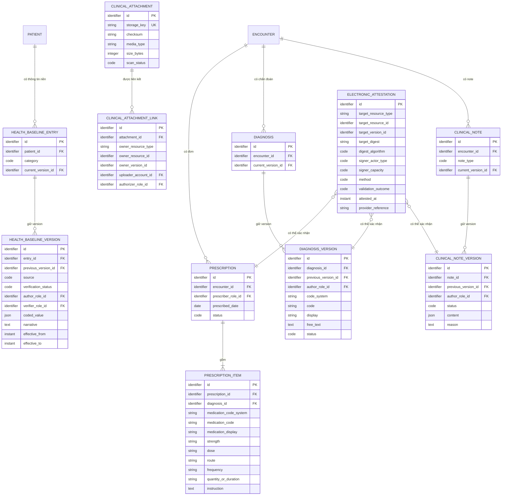
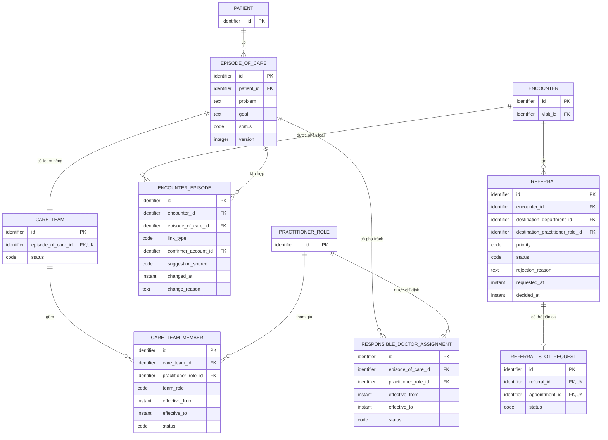
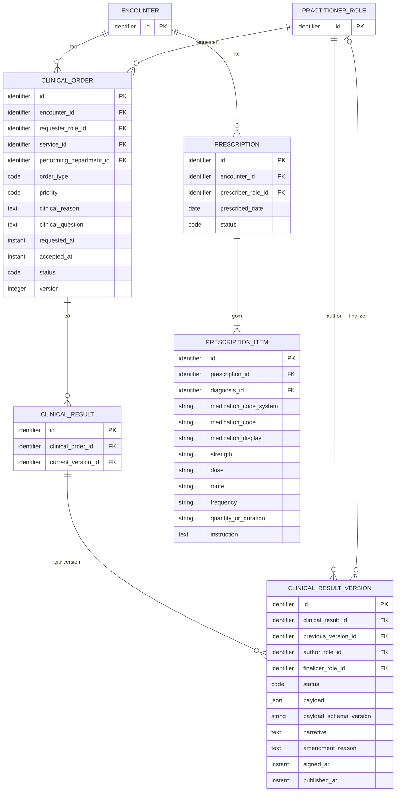
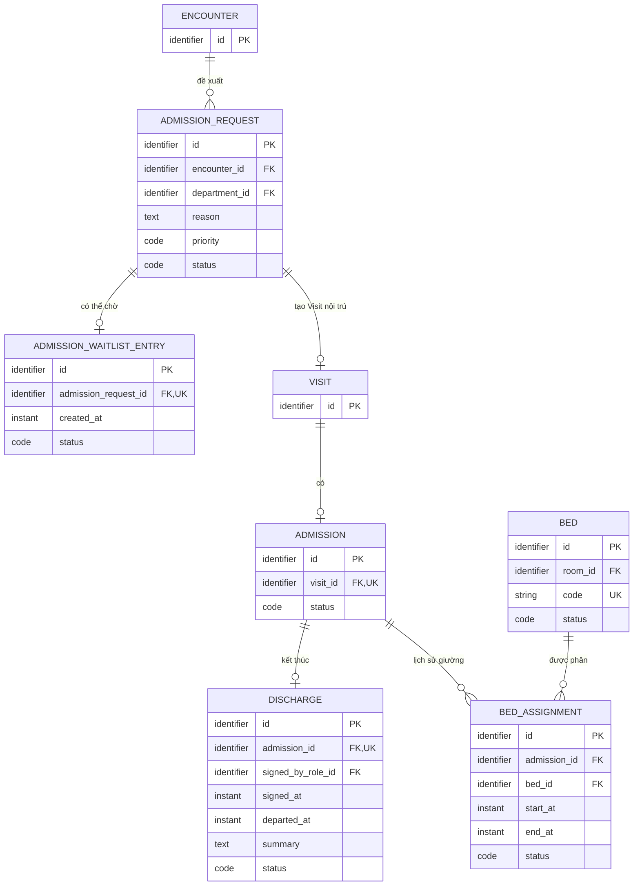
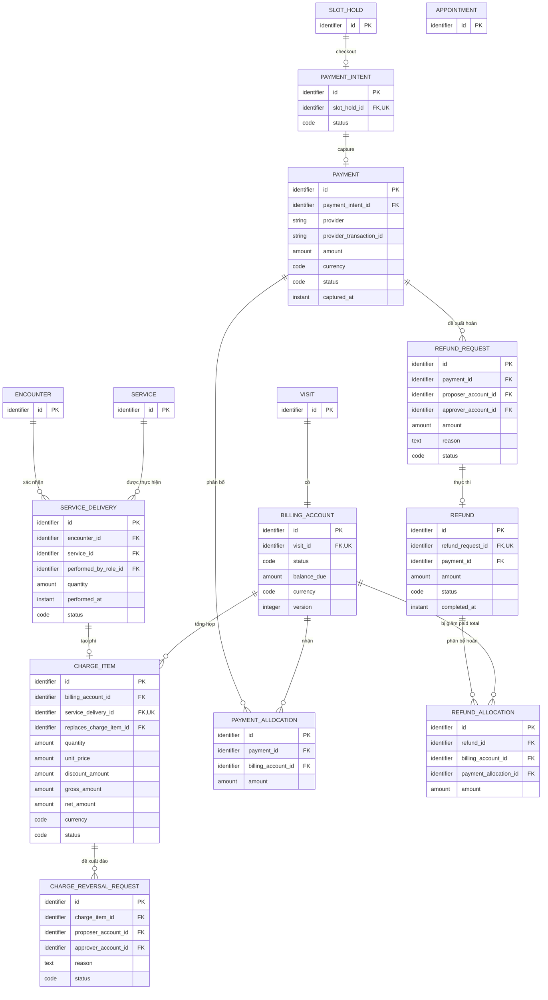
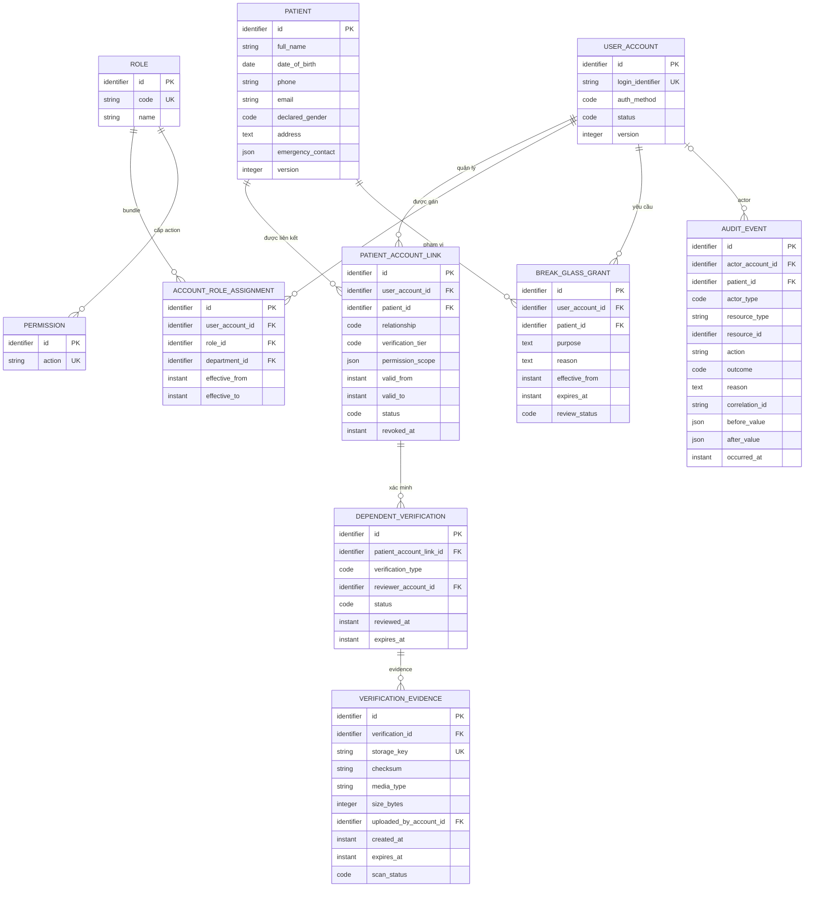
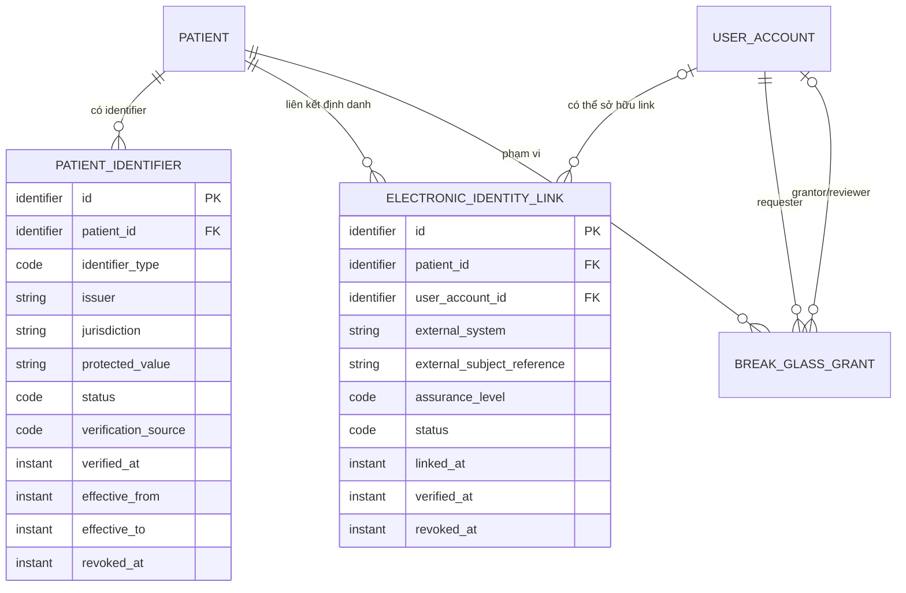

---
aliases:
  - Mô hình dữ liệu
tags:
  - do-an/du-lieu
source_sections:
  - 16
---
# Mô hình dữ liệu

<!-- obsidian-nav:start -->
[[10-thong-bao|Phần trước]] · [[docs|Mục lục]] · [[12-yeu-cau-phi-chuc-nang|Phần tiếp theo]]
<!-- obsidian-nav:end -->

## 16. Mô hình dữ liệu khái niệm

> [!IMPORTANT]
> Đây là ERD logic, không phải DDL. Kiểu PostgreSQL, nullability, constraint và index canonical nằm tại [[21-schema-vat-ly-mvp|Schema vật lý MVP]]. Migration chỉ được sinh từ schema vật lý đã ACCEPTED và ADR liên quan.

**Quy ước logic:** `identifier`, `code`, `string`, `text`, `date`, `instant`, `integer`, `amount`, `boolean`, `json`; `PK`, `FK`, `UK` là khóa logic. Nội dung chưa triển khai mang Decision ID `OPEN` hoặc `DEFERRED`.

Doctor là PractitionerRole của Practitioner theo `IAM-01`. Entity biên chỉ hiện khóa.

### 16.1. Lập kế hoạch, ca khám và cung cấp chăm sóc

```mermaid
erDiagram
    PRACTITIONER {
        identifier id PK
        identifier user_account_id FK, UK
        string staff_code UK
        string full_name
        boolean active
    }
    PRACTITIONER_ROLE {
        identifier id PK
        identifier practitioner_id FK
        identifier department_id FK
        code role_code
        instant effective_from
        instant effective_to
    }
    DEPARTMENT {
        identifier id PK
        string code UK
        string name
        boolean active
    }
    ROOM {
        identifier id PK
        identifier department_id FK
        string code UK
        string name
        boolean active
    }
    SERVICE {
        identifier id PK
        string code UK
        string name
        boolean active
    }
    APPOINTMENT_SLOT {
        identifier id PK
        identifier practitioner_role_id FK
        identifier department_id FK
        identifier room_id FK
        identifier service_id FK
        code session
        instant start_at
        instant end_at
        integer capacity
        integer version
    }
    SLOT_HOLD {
        identifier id PK
        identifier appointment_slot_id FK
        identifier patient_id FK
        instant expires_at
        amount deposit_snapshot
        code currency
        string idempotency_key
        code status
    }
    PAYMENT_INTENT {
        identifier id PK
        identifier slot_hold_id FK, UK
        string provider
        string provider_reference UK
        amount requested_amount
        code currency
        code status
    }
    PATIENT {
        identifier id PK
    }
    APPOINTMENT {
        identifier id PK
        identifier patient_id FK
        identifier slot_hold_id FK, UK
        identifier rescheduled_from_id FK
        identifier rescheduled_to_id FK
        code status
        integer version
    }
    CHECK_IN {
        identifier id PK
        identifier appointment_id FK, UK
        identifier visit_id FK, UK
        identifier actor_account_id FK
        code channel
        instant occurred_at
        boolean exception
        text exception_reason
        string idempotency_key UK
    }
    VISIT {
        identifier id PK
        identifier patient_id FK
        identifier appointment_id FK, UK
        code visit_type
        code status
        integer version
    }
    ENCOUNTER {
        identifier id PK
        identifier visit_id FK
        identifier department_id FK
        identifier room_id FK
        instant start_at
        instant end_at
        code status
        integer version
    }
    QUEUE_POLICY {
        identifier id PK
        identifier department_id FK
        integer current_ratio
        integer carry_over_ratio
        instant effective_from
        instant effective_to
        integer version
    }
    QUEUE_ENTRY {
        identifier id PK
        identifier encounter_id FK
        identifier queue_policy_id FK
        identifier department_id FK
        identifier room_id FK
        date service_date
        integer queue_number
        instant checked_in_at
        instant called_at
        instant service_started_at
        instant completed_at
        code status
        integer version
    }
    QUEUE_ADJUSTMENT {
        identifier id PK
        identifier queue_entry_id FK
        identifier actor_account_id FK
        json before_value
        json after_value
        instant adjusted_at
        text reason
    }
    ENCOUNTER_PARTICIPANT {
        identifier id PK
        identifier encounter_id FK
        identifier practitioner_role_id FK
        code participant_type
        instant effective_from
        instant effective_to
        code status
    }

    PRACTITIONER ||--o{ PRACTITIONER_ROLE : "có vai trò"
    DEPARTMENT ||--o{ PRACTITIONER_ROLE : "phân công"
    PRACTITIONER_ROLE ||--o{ APPOINTMENT_SLOT : "có ca"
    DEPARTMENT ||--o{ APPOINTMENT_SLOT : "mở ca"
    ROOM o|--o{ APPOINTMENT_SLOT : "phòng dự kiến"
    SERVICE ||--o{ APPOINTMENT_SLOT : "cung cấp"
    APPOINTMENT_SLOT ||--o{ SLOT_HOLD : "được giữ"
    PATIENT ||--o{ SLOT_HOLD : "giữ chỗ"
    SLOT_HOLD ||--o| PAYMENT_INTENT : "checkout"
    SLOT_HOLD ||--o| APPOINTMENT : "tạo"
    PATIENT ||--o{ APPOINTMENT : "có lịch"
    APPOINTMENT o|--o| VISIT : "có thể dẫn đến"
    APPOINTMENT o|--o| APPOINTMENT : "reschedule"
    APPOINTMENT ||--o| CHECK_IN : "được check-in"
    CHECK_IN ||--|| VISIT : "tạo hoặc lấy"
    PATIENT ||--o{ VISIT : "được tiếp nhận"
    VISIT ||--o{ ENCOUNTER : "gồm"
    ENCOUNTER ||--o{ ENCOUNTER_PARTICIPANT : "có participant"
    PRACTITIONER_ROLE ||--o{ ENCOUNTER_PARTICIPANT : "tham gia"
    ENCOUNTER ||--o{ QUEUE_ENTRY : "lịch sử queue"
    QUEUE_POLICY ||--o{ QUEUE_ENTRY : "điều phối"
    ROOM o|--o{ QUEUE_ENTRY : "gọi tại"
    QUEUE_ENTRY ||--o{ QUEUE_ADJUSTMENT : "điều chỉnh"
```

Capacity tính SlotHold ACTIVE và Appointment còn giữ reservation, gồm CONFIRMED/FULFILLED. CheckIn không giải phóng chỗ. Chỉ CONFIRMED chưa CheckIn/Visit mới NO_SHOW. Một Encounter tối đa một QueueEntry active. QueuePolicy mặc định 3 hiện tại : 1 tồn theo `QUEUE-07`.

### 16.1.1. Hồ sơ lâm sàng ngoại trú và attestation

`ElectronicAttestation` là quan hệ đa hình tới đúng target version/digest; Mermaid chỉ minh họa các target chính. Domain state `SIGNED` không tự chứng minh attestation hợp lệ. Category sức khỏe nền là design baseline `CLIN-03`; completeness pháp lý còn phụ thuộc mapping Chương X TT32.

### 16.2. EpisodeOfCare, CareTeam và Referral

EncounterEpisode tối đa một PRIMARY mỗi Encounter; Encounter/Visit/Episode cùng Patient. Mỗi Episode có một CareTeam và tối đa một responsible doctor hiệu lực. Merge/split mang `EPI-DEFER-01`, không có migration MVP. Referral SLA còn `OPEN-REF-01`.

### 16.3. Orders và Results

PRELIMINARY bắt buộc author; signed FINAL/AMENDED/CORRECTED bắt buộc authorized finalizer và attestation hợp lệ khi signer matrix yêu cầu; publish là transition riêng. Amendment/correction tạo version và attestation mới. ClinicalOrder phải chỉ rõ service/test, reason/priority/time/nơi thực hiện; quan hệ ServiceDelivery được kiểm tra theo cùng Encounter/Patient. Critical workflow còn `OPEN-ORD-02`; catalog không nhận critical test trước gate.

### 16.4. Nội trú và giường bệnh

> [!NOTE]
> Contract `INP-DEFER-01` thuộc sau MVP. Không có migration Release 1/MVP ngoại trú; ERD giữ extension boundary.

### 16.5. Billing và thanh toán

> [!IMPORTANT]
> Đây là ERD target R1, không phải runtime inventory. Hiện Flyway mới migrate `appointment` staging schema; `payment_intent`, `payment`, billing, allocation và refund chưa có migration. Physical contract tại [[schema/scheduling-payment-r1|Scheduling/payment R1]] và [[schema/billing-reliability-notification-r1|Billing/reliability R1]] là canonical.

Capture và Refund là movement bất biến; ledger không dựa current Payment status. ServiceDelivery là charge source duy nhất. BillingAccount close/reopen theo `BILL-08/BILL-09`.

### 16.6. Hồ sơ phụ thuộc và xác minh

> [!IMPORTANT]
> Diagram trộn runtime identity/patient tables với target R1 và MVP-LATER. `patient`, `patient_account_link`, `patient_identifier`, `patient_duplicate_candidate`, `account_role_assignment`, `break_glass_grant` và `audit_event` đã migrate. `dependent_verification`/`verification_evidence` là MVP-LATER; `electronic_identity_link` là REGULATORY-PRODUCTION. Xem [[21-schema-vat-ly-mvp|Schema vật lý MVP]] trước khi sinh DDL.

Patient phone nullable; contact canonical qua account/link. Tier 0/1/2 và evidence storage theo `DEP-06`–`DEP-11`. Permission scope deny-by-default; audit append-only.

#### 16.6.1. Định danh cá nhân, electronic identity và audit evidence

`BREAK_GLASS_GRANT` physical contract bổ sung requester, grantor/policy mechanism, reviewer, alert/ticket và review timestamps/outcome. `AUDIT_EVENT` bổ sung effective-role snapshot, purpose of use, authorization basis, source/session/request/correlation, export/download và review metadata. Raw biometric/private key/secret không thuộc các payload này.

### 16.7. Độ bao phủ và traceability

| Chủ đề | Contract canonical |
|---|---|
| Actor/catalog/RBAC | 16.1, 16.6/16.6.1; `IAM-01`, `CAT-01`, `SEC-03`–`SEC-05` |
| Hồ sơ lâm sàng/attestation | 16.1.1; `CLIN-01`–`CLIN-03`, `SIGN-01`, ADR-0007/0008 |
| Định danh cá nhân/electronic identity | 16.6.1; `IDN-01`, ADR-0008 |
| Scheduling/check-in/queue | 16.1; `APT-06`, `CHECKIN-01`, `QUEUE-06/07`, `VISIT-01/02` |
| Episode/Referral | 16.2; `OPEN-REF-01`, `EPI-DEFER-01` |
| Orders/Results | 16.3; `ORD-05`–`ORD-07`, `OPEN-ORD-02` |
| Inpatient | 16.4; `INP-DEFER-01` |
| Billing/payment | 16.5; `PAY-02`–`PAY-05`, `BILL-06`–`BILL-09`, `OPEN-PAY-01` |
| Dependent/privacy | 16.6; `DEP-06`–`DEP-11` |
| Kiểu/constraint/index | [[21-schema-vat-ly-mvp|Schema vật lý]], [[adr/README|ADR]] |

OPEN hợp lệ không chặn Release 1: `OPEN-PAY-01`, `OPEN-REF-01`, `OPEN-ORD-02`. Deferred: `EPI-DEFER-01`, `INP-DEFER-01`.

### 16.8. Quy tắc toàn vẹn

1. SlotHold expired không tạo Appointment; consumed tạo đúng một Appointment.
2. Reservation active không vượt capacity; check-in không giải phóng reservation.
3. Mỗi Doctor role tối đa 4 ca/ngày, 2 mỗi session.
4. Appointment có thể không có Visit; walk-in Visit có thể không có Appointment.
5. CheckIn idempotent tạo/lấy đúng một Visit cho Appointment.
6. Encounter suy ra Patient qua Visit; EncounterEpisode chỉ liên kết Episode cùng Patient.
7. Mỗi Episode có một CareTeam; tối đa một responsible doctor hiệu lực.
8. Mỗi Encounter tối đa một Episode PRIMARY.
9. QueueEntry tối đa một active mỗi Encounter; adjustment không sửa checked_in_at.
10. ClinicalNote/Diagnosis R1 `FINALIZED` và lawful-signed Result/content không ghi đè; amendment/correction tạo version mới, lawful tranche tạo attestation mới khi mapping yêu cầu.
11. `FINALIZED` chỉ là hoàn tất kỹ thuật. Domain state `SIGNED` không tự chứng minh giá trị pháp lý; attestation nhắm đúng immutable version/digest và sign tách publish.
12. Result phải thuộc Order hợp lệ; latest published version duy nhất.
13. Mỗi Visit đúng một BillingAccount.
14. Một ServiceDelivery tối đa một original ChargeItem.
15. Allocation/refund không vượt captured/refundable amount.
16. Proposer không tự approve financial adjustment.
17. Dependent clinical access cần Tier 2 + permission scope hợp lệ; signer capacity kiểm riêng.
18. Patient identifier/electronic identity mismatch hoặc revoke không auto-merge/relink.
19. Attachment nhắm đúng owner resource/version và checksum; binary không nằm trong DB.
20. Money dùng decimal; instant UTC; optimistic/version guard bắt buộc.
21. Audit/inbox/outbox/idempotency giữ correlation và không tạo side effect trùng.

---

<!-- related-links:start -->
## Liên kết liên quan

- [[20-so-quyet-dinh-kien-truc|Kiến trúc]]
- [[21-schema-vat-ly-mvp|Schema vật lý]]
- [[22-backlog-mvp|Backlog]]
- [[adr/README|ADR index]]
<!-- related-links:end -->
