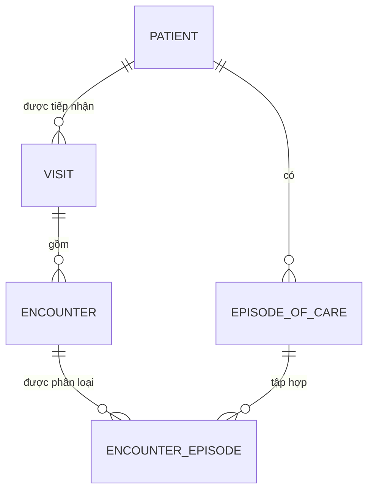
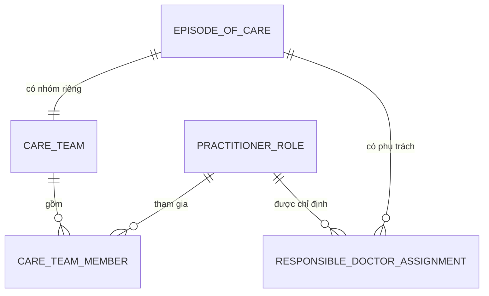
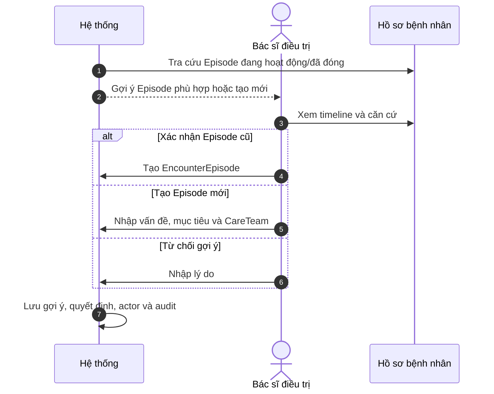
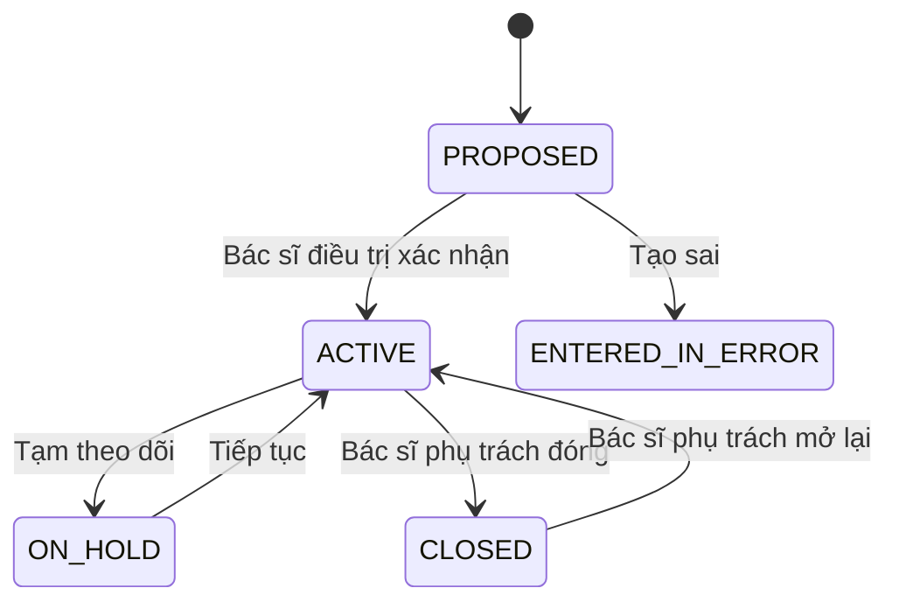
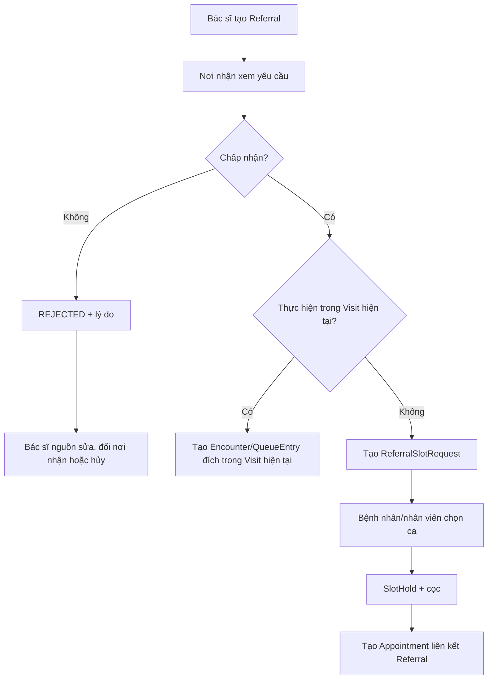

---
aliases:
  - EpisodeOfCare, CareTeam và Referral
tags:
  - do-an/nghiep-vu
  - do-an/ho-so
source_sections:
  - 25
---
# EpisodeOfCare, CareTeam và Referral

<!-- obsidian-nav:start -->
[[14-gia-dinh-cau-hoi-va-dinh-huong|Phần trước]] · [[docs|Mục lục]] · [[16-orders-va-results|Phần tiếp theo]]
<!-- obsidian-nav:end -->

## 25. Điều phối chăm sóc theo EpisodeOfCare

### 25.1. Ranh giới của EpisodeOfCare

Episode là đợt chăm sóc một vấn đề sức khỏe qua nhiều Visit, Encounter và chuyên khoa. Một Patient có thể có nhiều Episode hoạt động đồng thời; Episode không đại diện một ngày, bác sĩ hoặc khoa.

### 25.2. Quan hệ Patient — EpisodeOfCare — Visit — Encounter

Mỗi Encounter có tối đa một liên kết `PRIMARY` và nhiều liên kết `RELATED`. Tất cả Episode liên kết phải thuộc cùng Patient. EncounterEpisode lưu người xác nhận, nguồn gợi ý, thời gian và lý do thay đổi.

### 25.3. CareTeam và bác sĩ phụ trách

Mỗi Episode có một CareTeam riêng, không tái sử dụng giữa các Episode.

- CareTeamMember có vai trò, khoa, thời gian hiệu lực và trạng thái.
- Mỗi thời điểm Episode có một bác sĩ phụ trách đang hiệu lực.
- Bác sĩ phụ trách quyết định chuyên môn; điều phối viên được cấp quyền hỗ trợ thêm/loại thành viên.
- Mọi thay đổi giữ lịch sử, không xóa thành viên cũ.

### 25.4. Gợi ý Episode và quyết định chuyên môn

Bác sĩ đang điều trị tạo/xác nhận Episode. Hệ thống không tự kích hoạt, gộp, tách, đóng hoặc mở lại.

### 25.5. Trạng thái và điều kiện đóng EpisodeOfCare

- Chỉ bác sĩ phụ trách đang hiệu lực được đóng/mở lại.
- Hệ thống cảnh báo Encounter, Order, Referral hoặc Appointment còn mở.
- Cảnh báo không chặn cứng; bác sĩ phụ trách được override khi nhập lý do.
- Đóng Episode yêu cầu chẩn đoán cuối, kết quả, tóm tắt và kế hoạch tiếp theo theo design contract. Nội dung/signer bắt buộc pháp lý chỉ được khóa sau mapping Chương X TT32; nếu cần ký, dùng attestation theo ADR-0008.

### 25.6. Gộp và tách Episode

Gộp/tách thuộc sau MVP nhưng mô hình giữ contract:

- Bác sĩ phụ trách đề xuất, người/cấp có quyền phê duyệt.
- Gộp giữ mã nguồn, chuyển liên kết có kiểm soát và ghi Episode đích.
- Tách tạo Episode mới, chọn Encounter/Diagnosis chuyển sang.
- Lưu lineage, dữ liệu trước/sau, người đề xuất/duyệt và lý do.
- Cấp duyệt cụ thể được `DEFERRED` theo `EPI-DEFER-01`; không chặn MVP ngoại trú và chỉ mở lại trước merge/split tranche.

### 25.7. Referral nội bộ và liên chuyên khoa

Nơi nhận bắt buộc chấp nhận/từ chối; không tự động accepted. Referral không tự tạo Visit. SLA theo mức ưu tiên còn mở tại `OPEN-REF-01`.

### 25.8. Phạm vi MVP

MVP gồm Episode, CareTeam riêng, bác sĩ phụ trách, liên kết primary/related, cảnh báo khi đóng và Referral nội bộ hai nhánh. Gộp/tách nâng cao và Referral liên cơ sở để sau MVP.

---

<!-- related-links:start -->
## Liên kết liên quan

- [[04-vong-doi-va-nghiep-vu-lich-kham|Appointment, Visit và Encounter]]
- [[06-ho-so-suc-khoe-va-kham|Timeline bệnh nhân]]
- [[07-phan-quyen|Quyền chuyên môn]]
- [[11-mo-hinh-du-lieu#16.2. EpisodeOfCare, CareTeam và Referral|Mô hình Episode]]
- [[14-gia-dinh-cau-hoi-va-dinh-huong#22.2. Câu hỏi còn mở|Câu còn mở]]
<!-- related-links:end -->
