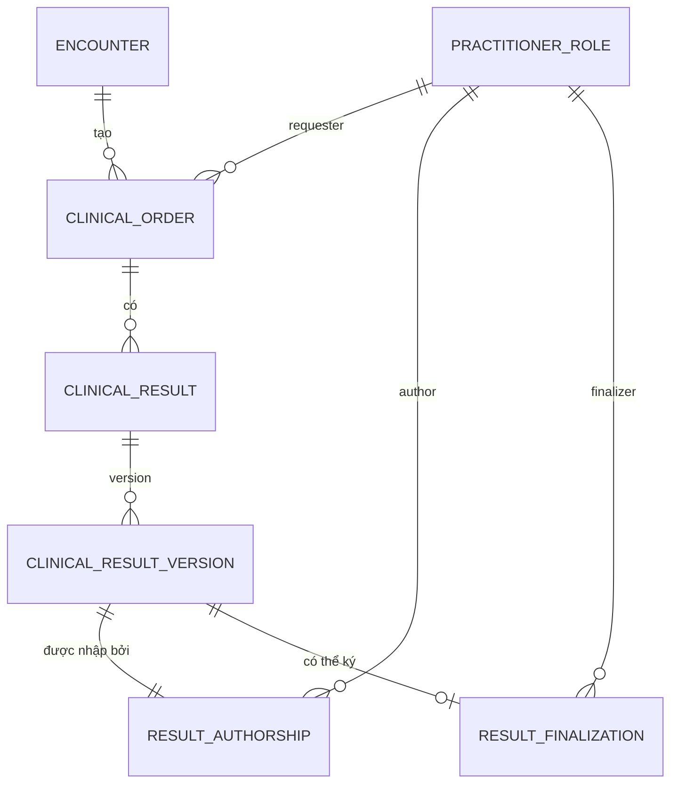
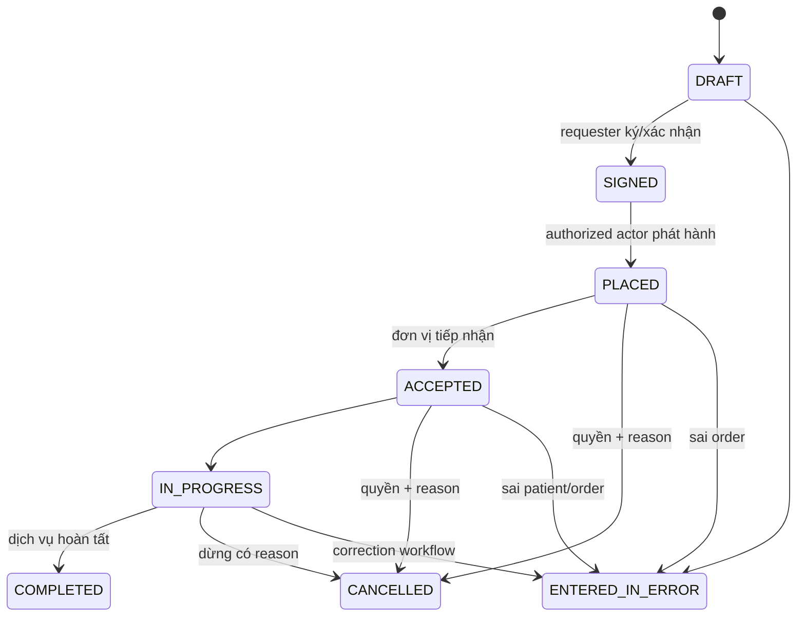
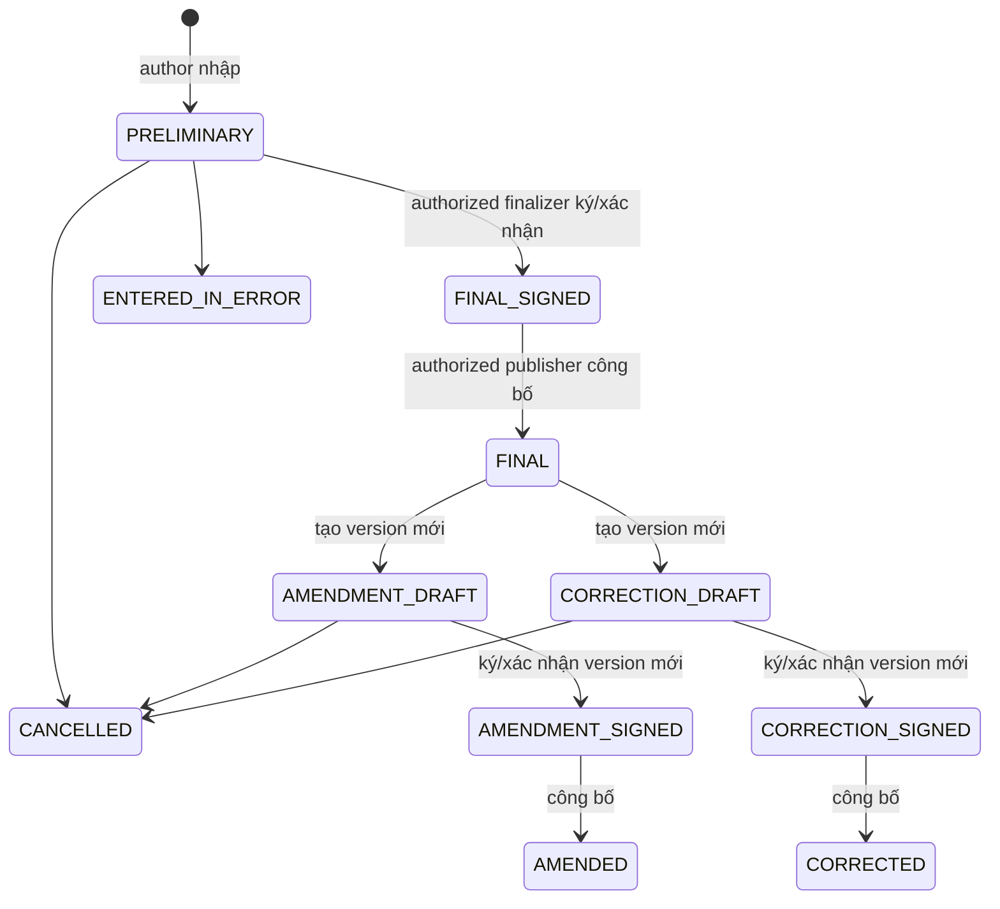

---
aliases:
  - Orders và Results
tags:
  - do-an/nghiep-vu
  - do-an/ho-so
source_sections:
  - 26
---
# Orders và Results

<!-- obsidian-nav:start -->
[[15-episode-careteam-va-referral|Phần trước]] · [[docs|Mục lục]] · [[17-noi-tru-va-giuong-benh|Phần tiếp theo]]
<!-- obsidian-nav:end -->

## 26. Chỉ định và kết quả

### 26.1. Ranh giới Order, Result và version

Order là yêu cầu. ClinicalResult là identity thuộc Order; ClinicalResultVersion là payload bất biến. Prescription là resource riêng.

### 26.2. Phạm vi loại Order

- `LABORATORY`: payload schema-versioned hỗ trợ item structured và narrative; chưa có Specimen/barcode/LIS.
- `DIAGNOSTIC_IMAGING`: findings, impression, narrative và attachment metadata; chưa tích hợp PACS.
- Catalog critical test không được bật trước khi `OPEN-ORD-02` đóng.

### 26.3. Vòng đời Order

- Doctor có `order.create` tạo draft; `order.sign` tạo attestation theo signer/method policy; phát hành Order là transition riêng.
- Receiving unit có permission nhận/bắt đầu/complete theo Order type và Department.
- Không tạo Result cho Order DRAFT, CANCELLED hoặc ENTERED_IN_ERROR.
- Order COMPLETED không tự đồng nghĩa Result FINAL.
- Complete ServiceDelivery có thể sinh ChargeItem; retry idempotent.

### 26.4. Vòng đời Result version

Signed payload không ghi đè. Domain state `SIGNED` chỉ là business state nếu chưa có `ElectronicAttestation` hợp lệ nhắm đúng version/digest. Amendment/correction tham chiếu version bị thay, reason, author, finalizer, attestation và timestamps. Latest attested, signed và published version là bản bệnh nhân được xem.

### 26.5. Payload và quyền ký

| Order type | Author | Finalizer | Payload tối thiểu |
|---|---|---|---|
| Laboratory | Technician/Practitioner có `result.author.lab` | PractitionerRole `LAB_APPROVER` + `result.finalize.lab` | schema version, items/narrative, interpretation |
| Diagnostic imaging | Technician/Radiologist có `result.author.imaging` | PractitionerRole `RADIOLOGIST` + `result.finalize.imaging` | findings, impression, narrative, attachment metadata |

Author và finalizer là hai relationship riêng. Có thể cùng người chỉ khi account có finalizer permission và signer capacity hợp lệ. Admin không mặc định ký. Phương thức/evidence ký hoặc xác nhận theo [[adr/0008-ranh-gioi-tuan-thu-ky-xac-nhan-va-dinh-danh-dien-tu|ADR-0008]] và `SIGN-01`; `INTERNAL_PROVENANCE` không được trình bày là chữ ký điện tử hợp pháp nếu chưa có Legal approval. Diagnostics production bị chặn khi signer/content/method matrix chưa được duyệt.

### 26.6. Attachment, Prescription và legal-signature boundary

Imaging attachment dùng `ClinicalAttachment`/`ClinicalAttachmentLink`, nhắm đúng ResultVersion và checksum; binary ở private object storage. Prescription là resource riêng và không được gộp vào ClinicalOrder/Result. Critical-result safety gate, attachment-security gate và legal-signature gate độc lập; đạt một gate không suy ra đạt gate khác.

### 26.7. Critical Result gate và phân kỳ

`OPEN-ORD-02` vẫn OPEN: threshold, recipient, SLA, escalation và acknowledgment cần Clinical Safety Owner phê duyệt. Trước khi đóng:

- Không cấu hình critical test trong catalog diagnostics.
- Không tuyên bố hỗ trợ critical-result workflow.
- Order/Result thông thường triển khai ở diagnostics tranche sau Release 1.

Sau MVP: Specimen/barcode, LIS/PACS, device integration và critical workflow đầy đủ.

Chi tiết: [[adr/0007-clinical-record-va-result-versioning|ADR-0007]], [[21-schema-vat-ly-mvp#Diagnostics|Schema]].

---

<!-- related-links:start -->
## Liên kết liên quan

- [[06-ho-so-suc-khoe-va-kham|Hồ sơ chuyên môn]]
- [[07-phan-quyen|Quyền signer]]
- [[10-thong-bao|Thông báo]]
- [[11-mo-hinh-du-lieu#16.3. Orders và Results|ERD]]
- [[23-ma-tran-yeu-cau-tt13-2025#4. Ma trận Điều 3 — ký, xác nhận điện tử|TT13 Điều 3]]
<!-- related-links:end -->
