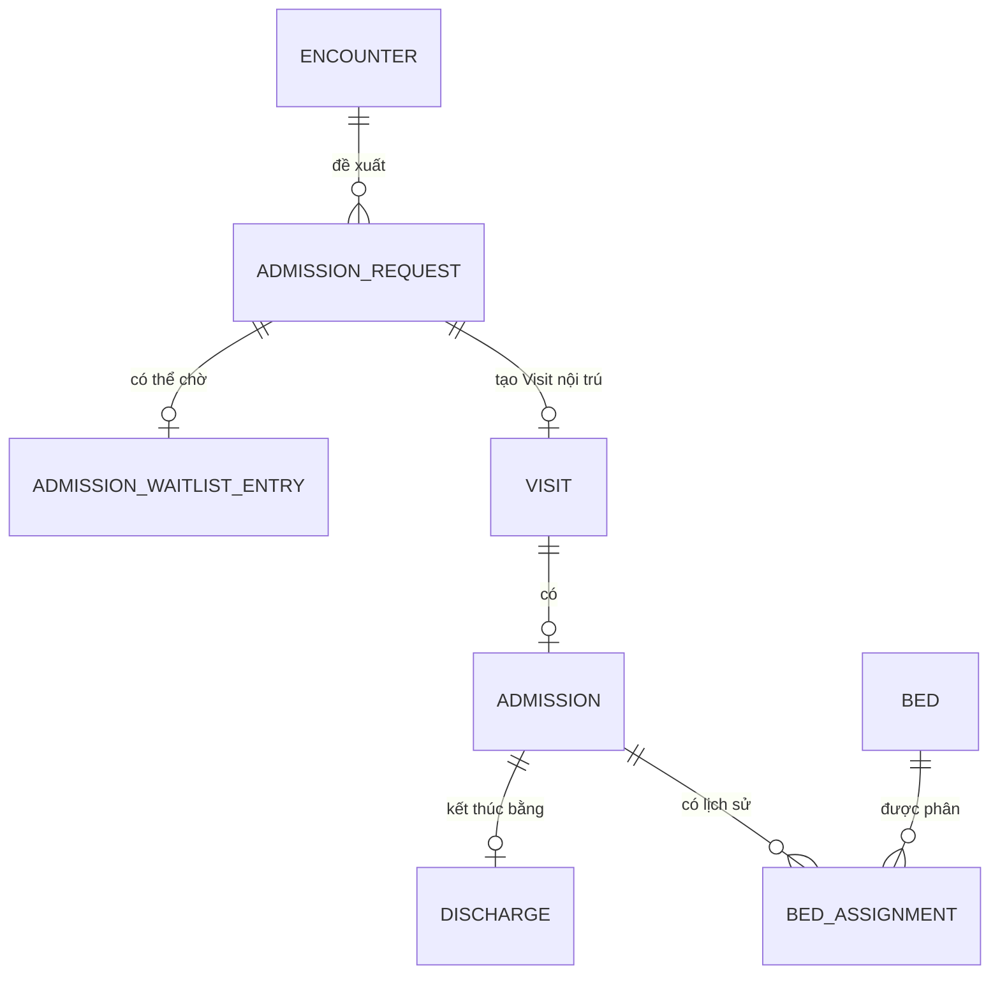
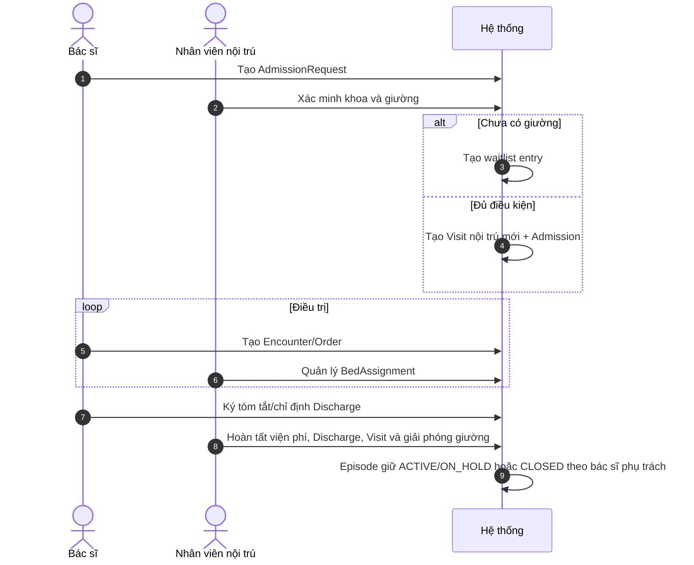

---
aliases:
  - Nội trú và quản lý giường bệnh
tags:
  - do-an/nghiep-vu
  - do-an/noi-tru
source_sections:
  - 27
---
# Nội trú và quản lý giường bệnh

<!-- obsidian-nav:start -->
[[16-orders-va-results|Phần trước]] · [[docs|Mục lục]] · [[18-billing-account-va-charge-item|Phần tiếp theo]]
<!-- obsidian-nav:end -->

## 27. Admission, Discharge và BedAssignment

### 27.1. Ranh giới Visit nội trú

Khi bác sĩ quyết định nhập viện từ Encounter ngoại trú, hệ thống giữ Visit ngoại trú và tạo **Visit nội trú mới** liên kết cùng Episode nếu phù hợp. Visit nội trú kéo dài từ nhập đến xuất viện; không tạo Visit mỗi ngày.

### 27.2. Mô hình dữ liệu

### 27.3. Admission request và danh sách chờ giường

1. Bác sĩ tạo AdmissionRequest từ Encounter, ghi lý do/khoa/mức ưu tiên.
2. Nhân viên nội trú xác minh thủ tục, khoa và khả năng giường.
3. Nếu chưa có giường phù hợp, tạo AdmissionWaitlistEntry.
4. Khi đủ điều kiện, tạo Visit nội trú mới và Admission `ADMITTED`.
5. Quy tắc ưu tiên/đặt trước/chuyển giường được `DEFERRED` theo `INP-DEFER-01`; phải chốt trước inpatient tranche.

AdmissionRequest: `REQUESTED`, `WAITLISTED`, `ACCEPTED`, `CANCELLED`, `ENTERED_IN_ERROR`.

Admission: `ADMITTED`, `DISCHARGED`, `ENTERED_IN_ERROR`.

### 27.4. BedAssignment và chuyển giường

- BedAssignment: `PLANNED`, `ACTIVE`, `ENDED`, `CANCELLED`, `ENTERED_IN_ERROR`.
- Không có hai assignment ACTIVE chồng lấn cùng giường.
- Chuyển giường kết thúc bản cũ rồi tạo bản mới.
- Tái nhập viện tạo Visit/Admission mới.

### 27.5. Quy trình nhập viện đến xuất viện

### 27.6. Phân kỳ triển khai

Các quyết định trên là contract kiến trúc sau MVP. Nội trú đầy đủ, UI giường, điều dưỡng, y lệnh, thuốc tại viện và billing nội trú chưa thuộc MVP ngoại trú.

---

<!-- related-links:start -->
## Liên kết liên quan

- [[11-mo-hinh-du-lieu#16.4. Nội trú và giường bệnh|Mô hình nội trú]]
- [[13-ke-hoach-va-nghiem-thu-mvp#19.1. Full MVP capability boundary|Phạm vi MVP]]
- [[14-gia-dinh-cau-hoi-va-dinh-huong#22.3. Quyết định deferred|Deferred inpatient]]
- [[15-episode-careteam-va-referral|Episode sau xuất viện]]
<!-- related-links:end -->
