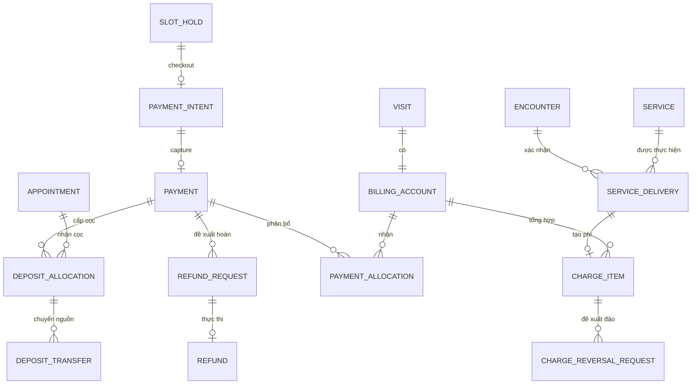
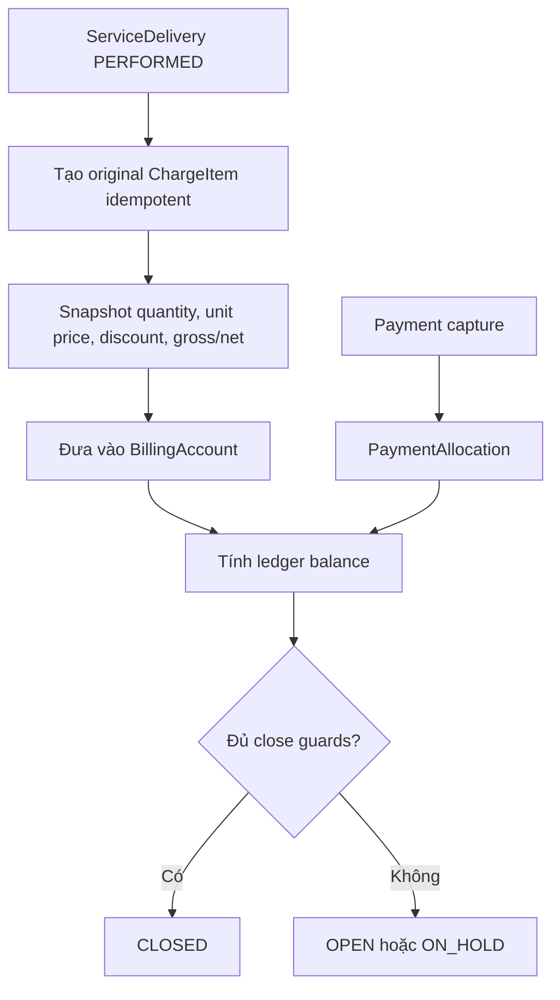

---
aliases:
  - BillingAccount và ChargeItem
tags:
  - do-an/nghiep-vu
  - do-an/tai-chinh
source_sections:
  - 28
---
# Tài khoản viện phí và khoản tính phí

<!-- obsidian-nav:start -->
[[17-noi-tru-va-giuong-benh|Phần trước]] · [[docs|Mục lục]] · [[19-ket-qua-phase-0|Phần tiếp theo]]
<!-- obsidian-nav:end -->

## 28. BillingAccount, ChargeItem và Payment

### 28.1. Ranh giới resource tài chính

- Mỗi Visit có đúng một BillingAccount.
- ServiceDelivery xác nhận dịch vụ thực hiện; một delivery tạo tối đa một original ChargeItem.
- PaymentIntent tồn tại trước Appointment và liên kết SlotHold.
- Payment là capture bất biến; PaymentAllocation phân bổ capture vào account.
- Refund là money movement ra; không xóa/chuyển đổi capture gốc.
- Charge reversal là workflow riêng nhắm ChargeItem.

### 28.2. Quan hệ dữ liệu



Payment tại quầy có thể không thuộc Appointment. Booking capture liên kết PaymentIntent; cọc liên kết Appointment qua immutable DepositAllocation, không ghi đè Payment. Reschedule dùng DepositTransfer giữ source/target lineage và chênh lệch cọc theo ADR-0011.

### 28.3. Trạng thái

- BillingAccount: `OPEN`, `ON_HOLD`, `CLOSED`, `VOID`.
- ServiceDelivery: `PLANNED`, `PERFORMED`, `CANCELLED`, `ENTERED_IN_ERROR`.
- ChargeItem: `BILLABLE`, `BILLED`, `REVERSED`, `ENTERED_IN_ERROR`.
- PaymentIntent: `PENDING`, `SUCCEEDED`, `FAILED`, `EXPIRED`, `RECONCILIATION_REQUIRED`, `REFUND_PENDING`, `REFUNDED`.
- Payment capture: `CAPTURED`, `VOIDED`, `ENTERED_IN_ERROR`; refund progress không thay capture thành dòng tiền khác.
- Adjustment request: `PROPOSED`, `APPROVED`, `REJECTED`, `EXECUTED`, `CANCELLED`.
- Refund: `PENDING`, `PROCESSING`, `COMPLETED`, `FAILED`, `CANCELLED`.

### 28.4. Phát sinh phí



Appointment/Order dự kiến không tự sinh phí. Unique ServiceDelivery → original ChargeItem chống replay/double charge. ServiceDelivery→Encounter→Visit phải trùng Visit của BillingAccount; cross-Visit charge bị từ chối. ChargeItem BILLED sửa bằng reversal + replacement.

### 28.5. Ledger và close/reopen

```text
charge_total = tổng net_amount hợp lệ, loại reversed originals
paid_total   = allocations từ captured payments - completed refund allocations của account
balance_due  = charge_total - paid_total
```

BillingAccount chỉ CLOSED khi Visit COMPLETED, mọi ServiceDelivery đã charge/reverse/error, không có PaymentIntent/Refund/Adjustment pending và balance bằng 0. Late ChargeItem hoặc adjustment sau close yêu cầu reopen bởi authorized manager, reason, optimistic version và audit.

### 28.6. Refund, reversal và separation of duties

- RefundRequest nhắm Payment; ChargeReversalRequest nhắm ChargeItem.
- Cashier proposer không được FinanceApprover cùng account approve.
- Chỉ APPROVED mới execute.
- Refund total không vượt captured amount còn refundable.
- Retry/inbox/reconciliation không tạo movement trùng.
- Refund dự kiến 3–7 ngày làm việc sau duyệt.

### 28.7. Phạm vi

Release 1: ServiceDelivery, ChargeItem, BillingAccount, cash/mock Payment, Allocation, close guards. Real QR phụ thuộc `OPEN-PAY-01`. Full refund/reversal và dashboard hardening ở release sau trong MVP. Billing nội trú, bảo hiểm, hóa đơn điện tử sau MVP.

Chi tiết: [[adr/0006-payment-slothold-va-billing-ledger|ADR-0006]], [[21-schema-vat-ly-mvp#Billing và payment|Schema]].

---

<!-- related-links:start -->
## Liên kết liên quan

- [[05-thanh-toan-va-doanh-thu|Chính sách tài chính]]
- [[07-phan-quyen|Quyền tài chính]]
- [[11-mo-hinh-du-lieu#16.5. Billing và thanh toán|ERD]]
- [[22-backlog-mvp|Backlog]]
<!-- related-links:end -->
