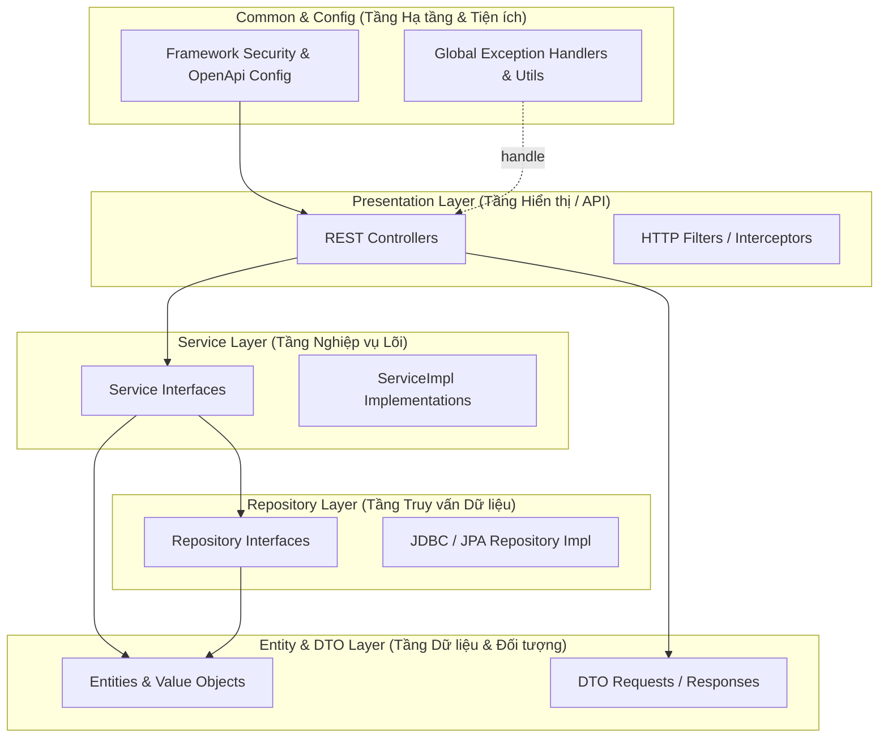

---
aliases:
  - Sổ quyết định kiến trúc
  - Architecture baseline
artifact_type: architecture-baseline
status: ACCEPTED
---
# Sổ quyết định kiến trúc

<!-- obsidian-nav:start -->
[[19-ket-qua-phase-0|Phần trước]] · [[docs|Mục lục]] · [[21-schema-vat-ly-mvp|Phần tiếp theo]]
<!-- obsidian-nav:end -->

## Baseline công nghệ

| Lớp | Quyết định |
|---|---|
| Frontend | React 19, TypeScript, Vite; Node.js 24 LTS cho toolchain |
| Backend | Java 21 LTS, Spring Boot 3.5.x, Layered Architecture (Clean Enterprise) |
| Persistence | Spring Data JPA / JDBC Template / Hibernate, Flyway Migration |
| Database | PostgreSQL 17.x |
| External contract | REST/JSON, OpenAPI 3.1 |
| Deployment MVP | Một frontend React, một backend Layered Architecture, một PostgreSQL database |
| Async | Transactional outbox trong PostgreSQL; chưa bắt buộc message broker |
| Payment | Port provider-neutral; mock adapter trong Release 1 |

---

## Mô hình Kiến trúc Phân tầng (Enterprise Layered Architecture)

Hệ thống Backend MediCore áp dụng chuẩn **Enterprise 5-Layered Architecture** nhằm tối ưu hóa việc phân chia trách nhiệm (Separation of Concerns), dễ bảo trì, mở rộng và tuân thủ các chuẩn dự án doanh nghiệp lớn (HIS, ERP Y tế):



### Nguyên tắc Kiến trúc

1. **Luồng phụ thuộc một chiều (Strict Downward Calls)**:
   `controller` (API) $\rightarrow$ `service` (Nghiep vu) $\rightarrow$ `repository` (Database) $\rightarrow$ `entity` (Du lieu).
2. **Quản lý ranh giới bằng ArchUnit (`LayeredArchitectureTest`)**: Tầng `controller` không được gọi trực tiếp `repository` hay truy vấn database trực tiếp. Tầng `service` không được phụ thuộc ngược lại `controller`.
3. **Quản lý Exception tập trung**: Toàn bộ lỗi nghiệp vụ (`CustomBusinessException`, `InvalidAuthenticationException`, `ResourceNotFoundException`, `RateLimitException`...) nằm tại `common.exception` và được bắt tự động bởi `GlobalExceptionHandler` (`@RestControllerAdvice`).

---

## Sơ đồ Thư mục Dự kiến Toàn bộ Dự án (Project Directory Layout)

```text
do_an_v2/
├── backend/                                                 # Mã nguồn Backend Spring Boot
│   ├── pom.xml                                              # Configuration Build Maven & Dependencies
│   ├── mvnw                                                 # Maven Wrapper Shell Script
│   └── src/
│       ├── main/
│       │   ├── java/
│       │   │   └── vn/
│       │   │       └── medicore/
│       │   │           ├── MediCoreApplication.java         # Class khởi chạy Spring Boot Main
│       │   │           │
│       │   │           ├── common/                          # TIỆN ÍCH & LỖI DÙNG CHUNG
│       │   │           │   ├── base/                        # BaseEntity, BaseController, BaseService
│       │   │           │   ├── constants/                   # ErrorCodes, SystemConstants, RegexConstants
│       │   │           │   ├── exception/                   # Xử lý lỗi toàn hệ thống
│       │   │           │   │   ├── GlobalExceptionHandler.java # (@RestControllerAdvice bắt lỗi tập trung)
│       │   │           │   │   ├── InvalidAuthenticationException.java
│       │   │           │   │   ├── ResourceNotFoundException.java
│       │   │           │   │   ├── RateLimitException.java
│       │   │           │   │   ├── InvalidCsrfException.java
│       │   │           │   │   └── StaleVersionException.java
│       │   │           │   └── utils/                       # Helpers (UuidV7Generator, DateUtils...)
│       │   │           │
│       │   │           ├── config/                          # CẤU HÌNH FRAMEWORK
│       │   │           │   ├── SecurityConfig.java          # Spring Security FilterChain, CORS, Authorization
│       │   │           │   ├── AuthProperties.java          # ConfigurationProperties cho Authentication
│       │   │           │   ├── SecretHasher.java            # Tiện ích mã hóa HMAC SHA-256 Secret
│       │   │           │   ├── OpenApiConfig.java           # Cấu hình tài liệu Swagger API
│       │   │           │   └── DatabaseConfig.java          # Cấu hình DataSource & Persistence
│       │   │           │
│       │   │           ├── controller/                      # TẦNG API (Giao tiếp HTTP REST & Filters)
│       │   │           │   ├── IdentityAccessController.java# API Đăng ký, Đăng nhập, Session, Role/Permission
│       │   │           │   ├── PlatformAuditController.java # API Audit Events & Break-Glass Grants
│       │   │           │   ├── PatientController.java       # API Quản lý hồ sơ Bệnh nhân (Dự kiến)
│       │   │           │   ├── ClinicalCareController.java  # API Hồ sơ bệnh án & Khám bệnh (Dự kiến)
│       │   │           │   ├── SchedulingController.java    # API Lịch khám & Đặt chỗ (Dự kiến)
│       │   │           │   ├── SessionAuthenticationFilter.java # Security Filter kiểm tra Session Cookie
│       │   │           │   └── IdempotencyFilter.java       # Filter đảm bảo Idempotency request HTTP
│       │   │           │
│       │   │           ├── dto/                             # DATA TRANSFER OBJECTS
│       │   │           │   ├── request/                     # Objects Client gửi lên chứa annotation @Valid
│       │   │           │   ├── response/                    # Objects dữ liệu trả về cho Client
│       │   │           │   ├── IdentityModels.java          # Identity Request/Response DTOs & Page Wrappers
│       │   │           │   ├── AuditModels.java             # Audit Request/Response DTOs & Page Wrappers
│       │   │           │   ├── AuthenticatedAccount.java    # Principal chứa thông tin Account & Permissions
│       │   │           │   └── SecurityAuditRecorder.java   # Interface ghi log audit an ninh
│       │   │           │
│       │   │           ├── entity/                          # TẦNG ENTITIES (Mapping với Database)
│       │   │           │   ├── UserAccount.java             # Map với bảng user_account
│       │   │           │   ├── AccountSession.java          # Map với bảng account_session
│       │   │           │   ├── AuthenticationChallenge.java # Map với bảng authentication_challenge
│       │   │           │   ├── EmailAddress.java            # Value Object kiểm tra & chuẩn hóa email
│       │   │           │   └── AccountStatus.java           # Enum trạng thái tài khoản (ACTIVE, LOCKED...)
│       │   │           │
│       │   │           ├── repository/                      # TẦNG TRUY VẤN DỮ LIỆU & ADAPTERS
│       │   │           │   ├── IdentityRepository.java      # Interface định nghĩa các câu lệnh truy vấn Auth
│       │   │           │   ├── PlatformAuditRepository.java # Interface truy vấn Audit Log
│       │   │           │   └── impl/                        # Thư mục thực thi JDBC / JPA / Native SQL
│       │   │           │       ├── IdentityJdbcRepositoryImpl.java
│       │   │           │       └── PlatformAuditJdbcRepositoryImpl.java
│       │   │           │
│       │   │           └── service/                         # TẦNG NGHIỆP VỤ LÕI (Service Interfaces & Impl)
│       │   │               ├── IdentityAccessService.java   # Interface định nghĩa hành động Đăng nhập/Quyền
│       │   │               ├── PlatformAuditService.java    # Interface định nghĩa hành động Audit/BreakGlass
│       │   │               ├── AuthenticationDeliveryService.java # Interface gửi thông báo OTP/Email
│       │   │               └── impl/                        # Thư mục chứa mã thực thi nghiệp vụ lõi
│       │   │                   ├── IdentityAccessServiceImpl.java # Xử lý logic Đăng ký, Đăng nhập, Session
│       │   │                   ├── PlatformAuditServiceImpl.java  # Xử lý logic Audit, BreakGlass Grant
│       │   │                   ├── IdempotencyServiceImpl.java    # Xử lý giữ chỗ & chống trùng request
│       │   │                   ├── SecurityAuditServiceImpl.java  # Thực thi ghi log an ninh
│       │   │                   ├── PasswordPolicy.java            # Kiểm tra quy tắc độ mạnh mật khẩu
│       │   │                   ├── LoggingAuthenticationDeliveryImpl.java # Adapter log OTP cho Local/Test
│       │   │                   └── SmtpAuthenticationDeliveryImpl.java    # Adapter gửi Email qua SMTP
│       │   │
│       │   └── resources/
│       │       ├── application.yml                          # Cấu hình chính (Port, DB Credentials, Security)
│       │       ├── static/api/v1/medicore.openapi.yaml      # Canonical OpenAPI Spec Contract
│       │       └── db/migration/                            # Nơi chứa các Flyway Migration SQL Scripts
│       │           └── V1__Init_Tables.sql                  # Script khởi tạo toàn bộ bảng CSDL
│       │
│       └── test/                                            # THƯ MỤC UNIT & ARCHITECTURE TEST
│           └── java/
│               └── vn/
│                   └── medicore/
│                       ├── UuidV7GeneratorTest.java
│                       ├── architecture/
│                       │   └── LayeredArchitectureTest.java # Kiểm tra tuân thủ ranh giới phân tầng
│                       ├── entity/                          # Test logic các Entities & Value Objects
│                       │   ├── AccountSessionTest.java
│                       │   ├── AuthenticationChallengeTest.java
│                       │   └── EmailAddressTest.java
│                       ├── api/                             # Integration Tests cho REST API
│                       │   ├── AuthenticationIT.java
│                       │   └── OpenApiIT.java
│                       └── persistence/                     # Integration Test cho DB Migration
│                           └── FlywayMigrationIT.java
│
├── frontend/                                                # Mã nguồn Frontend (React 19 + Vite)
│   ├── package.json
│   ├── vite.config.ts
│   └── src/
│       ├── components/                                      # Reusable UI Components
│       ├── pages/                                           # Các trang giao diện (Login, Dashboard...)
│       ├── services/                                        # API Services gọi về Backend REST API
│       └── styles/                                          # CSS Design Tokens
│
├── contracts/                                               # Chứa Contract OpenAPI 3.1 chuẩn
│   └── openapi/
│       └── medicore.openapi.yaml
│
└── docs/                                                    # Tài liệu thiết kế hệ thống
    ├── 20-so-quyet-dinh-kien-truc.md                        # Sổ quyết định kiến trúc (File này)
    ├── 21-schema-vat-ly-mvp.md                              # Schema CSDL Vật lý
    ├── 22-backlog-mvp.md                                    # Backlog tính năng MVP
    ├── 25-api-inventory-r1.md                               # Danh mục API Release 1
    └── adr/                                                 # Chi tiết các quyết định ADR
```

---

## Technical Cross-Cutting Controls

- **Kiểm thử ranh giới**: Sử dụng `LayeredArchitectureTest` trong ArchUnit để đảm bảo tính đóng gói và luồng gọi đúng hướng giữa các tầng (`controller` $\rightarrow$ `service` $\rightarrow$ `repository` $\rightarrow$ `entity`).
- **Data Integrity & Concurrency**: Sử dụng Optimistic Locking (`version`), Advisory Locks PostgreSQL cho các luồng găng (Registration / Challenge IP Rate limit).
- **Security & Audit**: Toàn bộ thao tác nhạy cảm (như Break-Glass) bắt buộc có bằng chứng Audit Log ghi nhận vào bảng `audit_event` không thể sửa xóa (append-only).

---

## Quy tắc Lập trình (Coding Standards & Rules cho AI Agents & Developers)

Để đảm bảo chất lượng mã nguồn đồng nhất khi có nhiều AI Agent hoặc Lập trình viên cùng tham gia phát triển:

1. **Tuân thủ Cấu trúc Phân tầng (Layering Discipline)**:
   - Các gói phải nằm trong 7 tầng ngang: `common`, `config`, `controller`, `dto`, `entity`, `repository`, `service`.
   - `controller` chỉ gọi `service`, không được inject hay gọi `repository` trực tiếp.
   - `service` xử lý toàn bộ logic nghiệp vụ, gọi `repository` để tương tác với database.
   - Chạy test kiểm tra ranh giới sau mỗi thay đổi:

     ```bash
     JAVA_HOME=/usr/local/opt/openjdk@21/libexec/openjdk.jdk/Contents/Home ./mvnw test -Dtest=LayeredArchitectureTest
     ```

2. **Quy tắc Xử lý Exception & Báo lỗi**:
   - Mọi exception nghiệp vụ phải nằm trong gói `vn.medicore.common.exception`.
   - Bắt và trả về lỗi tập trung tại `GlobalExceptionHandler` theo chuẩn RFC 7807 `ProblemDetail`.
   - Tuyệt đối không nuốt (swallow) exception hay trả về dữ liệu giả rỗng khi xảy ra lỗi.

3. **Quy tắc An toàn Dữ liệu & Xử lý Đồng thời**:
   - Sử dụng `version` (Optimistic Locking) cho các thao tác cập nhật dữ liệu. Khi có rủi ro xung đột version, hệ thống throw `StaleVersionException` (HTTP `412 Precondition Failed`).
   - Sử dụng PostgreSQL Advisory Lock (`pg_advisory_xact_lock`) cho các luồng găng chống spam / rate limit.

4. **Quy tắc Khớp Hợp đồng OpenAPI**:
   - DTOs và Controller Endpoints phải khớp 100% với hợp đồng canonical `contracts/openapi/medicore.openapi.yaml`.

5. **Quy tắc Git Workflow (Branching, Staging & Commit Messages)**:
   - **Tạo nhánh**:
     - Feature: `feat/<ma-backlog>-<ten-ngan-gon>` (Ví dụ: `feat/r1-02-authentication`)
     - Fix: `fix/<ma-issue>-<ten-ngan-gon>` (Ví dụ: `fix/r1-02-csrf-validation`)
     - Refactor: `refactor/<ten-chuc-nang>` (Ví dụ: `refactor/backend-layered-architecture`)
   - **Staging (`git add`)**: Kiểm tra kỹ các file cần add; không add file tạm, build output (`target/`, `.DS_Store`, `.claude/worktrees/`).
   - **Commit Message (Conventional Commits)**:
     - Định dạng: `<type>(<scope>): <mô tả>`
     - Ví dụ: `feat(auth): implement session authentication`, `refactor(backend): restructure package layout to 7-layer architecture`.

---

<!-- related-links:start -->
## Liên kết liên quan

- [[adr/README|ADR index]]
- [[21-schema-vat-ly-mvp|Schema vật lý]]
- [[22-backlog-mvp|Backlog MVP]]
- [[25-api-inventory-r1|Danh mục API Release 1]]
- [[26-git-cheatsheet-huong-dan-git-workflow|Git Cheat Sheet & Workflow]]
<!-- related-links:end -->
