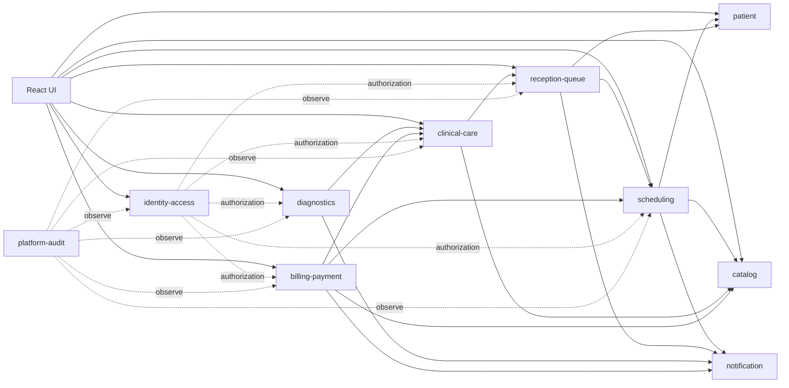
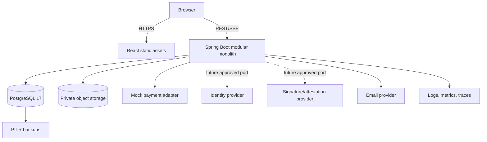

---
aliases:
  - Sổ quyết định kiến trúc
  - Architecture baseline
artifact_type: architecture-baseline
status: ACCEPTED
---
# Sổ quyết định kiến trúc

<!-- obsidian-nav:start -->
[[19-ket-qua-phase-0|Phần trước]] · [[docs|Mục lục]] · [[21-schema-vat-ly-mvp|Phần tiếp theo]]
<!-- obsidian-nav:end -->

## Baseline công nghệ

| Lớp | Quyết định |
|---|---|
| Frontend | React 19, TypeScript, Vite; Node.js 24 LTS cho toolchain |
| Backend | Java 21 LTS, Spring Boot 3.5.x, Spring Modulith |
| Persistence | Spring Data JPA/Hibernate, Flyway |
| Database | PostgreSQL 17.x |
| External contract | REST/JSON, OpenAPI |
| Deployment MVP | Một frontend, một backend modular monolith, một PostgreSQL database |
| Async | Transactional outbox trong PostgreSQL; chưa bắt buộc broker |
| Payment | Port provider-neutral; mock adapter trong Release 1 |

Patch version được pin khi scaffold Phase 1. Baseline major/minor và nguyên tắc kiến trúc đã `ACCEPTED` tại [[adr/0001-stack-va-modular-monolith|ADR-0001]].

## Module map

## Ownership và dependency

| Module | Sở hữu chính |
|---|---|
| `identity-access` | UserAccount, password credential, OTP/challenge, one-time token, server session, Role, Permission, assignments, BreakGlassGrant, attestation verification policy/port |
| `catalog` | Department, Room, Service, ServicePrice, Practitioner, PractitionerRole |
| `patient` | Patient, PatientIdentifier, ElectronicIdentityLink, PatientAccountLink, DependentVerification, evidence metadata |
| `scheduling` | AppointmentSlot, SlotHold, Appointment, PaymentIntent port request |
| `reception-queue` | CheckIn, Visit, Encounter shell, QueuePolicy, QueueEntry, QueueAdjustment |
| `clinical-care` | Encounter clinical lifecycle, ClinicalNote, Diagnosis, HealthBaseline, Prescription/Item, ClinicalAttachment metadata/link, Episode/CareTeam/Referral |
| `diagnostics` | ClinicalOrder, ClinicalResult và immutable versions |
| `billing-payment` | ServiceDelivery, BillingAccount, ChargeItem, Payment, Allocation, Refund/Reversal |
| `notification` | NotificationDelivery, templates, outbox consumer |
| `platform-audit` | AuditEvent, ElectronicAttestation evidence index, IdempotencyRecord, WebhookInbox, OutboxEvent, conversion evidence và observability conventions |

Quy tắc:

1. Package theo module, không chia ngang toàn hệ thống thành `controller/service/repository`.
2. Module khác gọi public application API hoặc domain event.
3. Không dùng JPA entity của module khác làm association; giữ ID/value object.
4. Module sở hữu bảng và migration của mình.
5. FK database vẫn dùng cho quan hệ ổn định cần toàn vẹn trong modular monolith.
6. `shared-kernel` chỉ chứa ID, money, instant và lỗi cơ bản; không chứa nghiệp vụ dùng chung giả tạo.
7. Transaction xuyên module chỉ dùng trong thin slice khi invariant bắt buộc; phải có application service owner và test integration.
8. External API dùng OpenAPI source-first: module sở hữu path/schema fragment trong `contracts/openapi/modules`; `medicore.openapi.yaml` bundled là contract canonical. Controller/DTO phải conform, không sinh contract mới ngầm từ implementation.

## Deployment baseline

- Queue screen dùng SSE hoặc polling có conditional request; WebSocket không bắt buộc Release 1.
- Evidence/clinical attachment binary không lưu trong PostgreSQL.
- Identity/signature provider chỉ là port; không chọn provider hoặc tuyên bố kết nối khi `IDN-02`/`SIGN-01` còn OPEN. R1 chỉ thu thập/bảo vệ `PatientIdentifier` theo `IDN-01`.
- Secrets/private keys/raw biometric không lưu trong domain DB, code, audit hoặc tài liệu.
- Deployment contract phải có workstation/network/compute/storage/backup/security inventory và restore/retrieval evidence theo từng cơ sở; sơ đồ cloud không thay bằng chứng.

## Cross-cutting contract

- ID/time/money/delete: [[adr/0002-postgresql-dinh-danh-tien-va-thoi-gian|ADR-0002]].
- Authentication/session/account security: [[adr/0010-authentication-session-va-account-security|ADR-0010]].
- Locking/idempotency/inbox/outbox: [[adr/0003-concurrency-idempotency-inbox-outbox|ADR-0003]].
- Provider event time/reschedule deposit: [[adr/0011-provider-event-time-va-reschedule-deposit|ADR-0011]].
- Technical finalization/lawful signing boundary: [[adr/0012-technical-finalization-va-lawful-signing-boundary|ADR-0012]].
- API contract/versioning/error/idempotency: [[adr/0013-api-contract-versioning-error-idempotency|ADR-0013]].
- RBAC/audit/privacy: [[adr/0004-actor-rbac-audit-va-dependent-privacy|ADR-0004]].
- Scheduling/queue: [[adr/0005-appointment-checkin-queue-va-reschedule|ADR-0005]].
- Payment/billing: [[adr/0006-payment-slothold-va-billing-ledger|ADR-0006]].
- Clinical/versioning: [[adr/0007-clinical-record-va-result-versioning|ADR-0007]].
- Compliance boundary, attestation và identity: [[adr/0008-ranh-gioi-tuan-thu-ky-xac-nhan-va-dinh-danh-dien-tu|ADR-0008 — PROPOSED]].

## Release boundary

Release 1 chỉ triển khai thin operational slice trong [[22-backlog-mvp#Release 1 — Thin operational slice|Backlog MVP]]. Real QR, dependent nâng cao, Episode/Referral, diagnostics và dashboard có release gate riêng.

---

<!-- related-links:start -->
## Liên kết liên quan

- [[adr/README|ADR index]]
- [[14-gia-dinh-cau-hoi-va-dinh-huong#22.1. Quyết định đã chốt|Decision register]]
- [[21-schema-vat-ly-mvp|Schema vật lý]]
- [[22-backlog-mvp|Backlog]]
<!-- related-links:end -->
